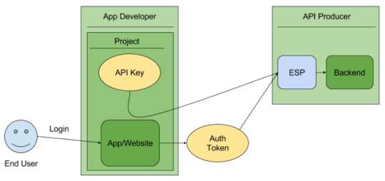

# API - Authentication and Authorization

## HTTP Authentication

### Authentication vs Authorization
**Authentication** is when an entity proves an identity. In other words, **Authentication** proves that you are who you say you are.
**Authorization** Authorization is when an entity proves a right to access. In other words, Authorization proves you have the right to make a request. 

### HTTP Basic Authentication
An HTTP user agent simply provides a username and password to prove their authentication. This approach uses the **HTTP header** in the form of `Authorization: Basic <credentials>`, where credentials is the base64 encoding of id and password joined by a single colon `:`. 

**Warning**: Although it encrypts the credentials to the base64 encode, the credentials are **NOT encrypted**.

### HTTP Bearer Authentication
Bearer authentication (also called token authentication) is a HTTP authentication that uses security tokens ccalled bearer tokens.

The token of this authentication is a cryptic string (e.g. JWT)
`Authorization: Bearer <token>`

#### JWT

### API Keys
An application programming interface key (API key) is a **unique identifier** (secret token) which is submitted alongside web service (or similar) requests in order to identify the origin of the request. 

**Warning:** is that API keys are often used for what they’re not – an API key is not a method of authorization, it’s a method of authentication. 

#### Why and when to use API keys
**API keys are for projects, authentication is for users**, in other words, API keys identify the calling project (application or site) making the call to an API. on the other hand, authentication tokens identify a user (person), that is using the app or site.

By identifying the calling project, you can use API keys to associate usage information with that project.

API keys are generally not considered secure; they are typically accessible to clients, making it easy for someone to steal an API key. Once the key is stolen, it has no expiration, so it may be used indefinitely, unless the project owner revokes or regenerates the key.

### When to use API Keys
* Block anonymous traffic. API keys identify an application's traffic. That maybe is useful if there are some need to debug an issue or show the application's usage
* Controll the number of call made to your API
* Identify usage pattern
* Filter logs by API Keys

#### When not use API Keys
* Identify individual users
* Secure authorization
* identify the creators of a project

#### Handling API Keys
* Do not embed API keys directly in code. Instead of embedding your API keys in your applications, store them in environment variables or in files outside of your application's source tree.

### OAuth

## OpenID
OpenID is an open standard for authentication. 

### OpenID Connect 
OpenID Connect is an identity layer on top of the OAuth 2.0 protocol. It allows clients o request and receive information about authenticated sessions as well as providing access to backend APIs using OAuth 2.0 tokens. In short, It gives an identity provider the ability to provide clients with enduser's identication and basic profile information.

 It uses JWTs (JSON Web Tokens) as identity token format.

The **Key Distribution** provided by OpenID Connect is called JSON Web Key Set (JWKS);

**User Information**
OpenID Connect provides endpoints for Clients to use when they need access to user data. It also provides mechanisms for the user to consent before this data is released to the client.

**OpenID Connect Core Features**
-   Core: authentication and use of Claims to communicate End-User information
-   Discovery: stipulates how a client can dynamically determine information about OpenID Providers
-   Dynamic Registration: dictates how a client can register with a provider
-   Session Management: defines how to manage OIDC sessions

## OpenID vs OAuth
"OpenID is for humans logging into machines, OAuth is for machines logging into machines on behalf of humans."

### SAML
It’s an open standard that provides both authentication and authorization.

## Authorization
### Role-Based Access Control
### Attribute-Based Access Control
### Delegated Access Control with OAuth 2.0

## References
[3-common-methods-api-authentication-explained/](https://nordicapis.com/3-common-methods-api-authentication-explained/)
[when-why-api-key#security_of_api_keys](https://cloud.google.com/endpoints/docs/openapi/when-why-api-key#security_of_api_keys)
[authentication - api-keys](https://cloud.google.com/docs/authentication/api-keys)

